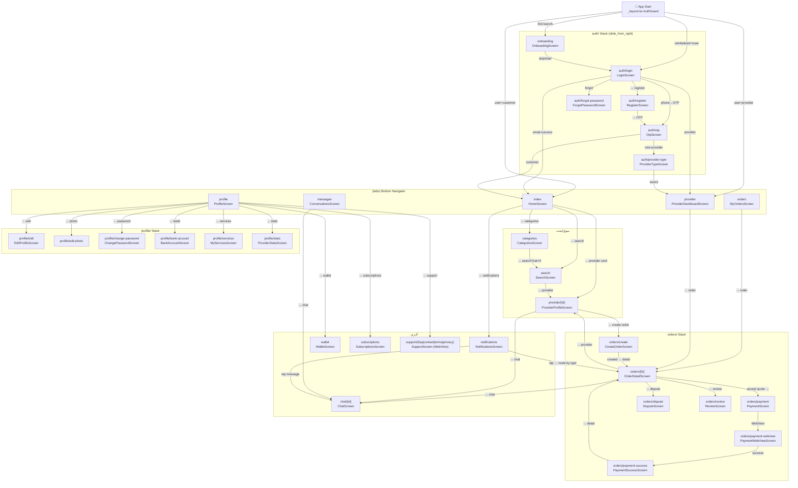
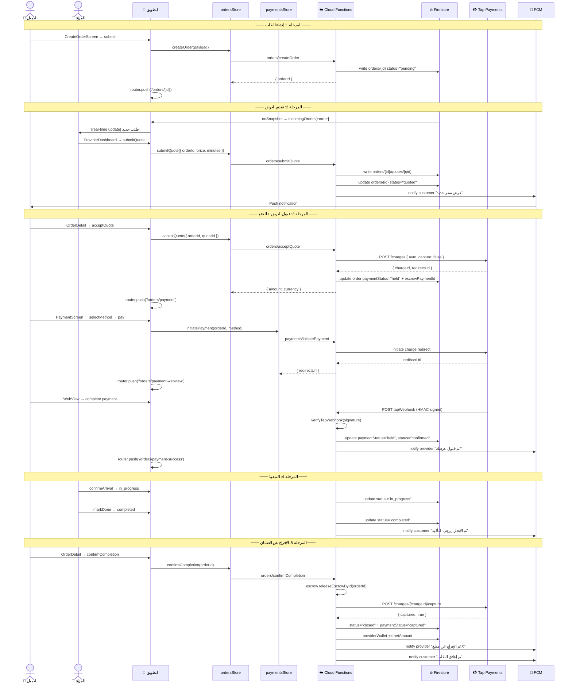

# WorkFix — وثيقة المشروع الشاملة
## Part 1/3 — الأقسام (1) إلى (5)

---

## (1) جرد الملفات — Full File Inventory

### 1.1 شجرة الملفات الكاملة

```text
workfix/                                   ← جذر monorepo  (Turborepo + pnpm 9)
├── .detoxrc.js                            ← إعدادات E2E Detox (iOS sim + Android emu)
├── .env.example                           ← قالب متغيرات البيئة (بدون أسرار)
├── .eslintrc.json                         ← قواعد ESLint مشتركة (TypeScript + react-hooks)
├── .prettierignore                        ← استثناءات Prettier
├── .prettierrc                            ← singleQuote / semi:false / printWidth:100
├── README.md                             ← توثيق تشغيل المشروع
├── firebase.json                         ← Emulators + functions.runtime:nodejs20
├── firestore.indexes.json                ← 13 فهرس مركّب
├── firestore.rules                       ← قواعد الأمان Firestore (role-based)
├── storage.rules                         ← قواعد Storage مع حدود الحجم
├── package.json                          ← devDeps الجذر: turbo/eslint/prettier
├── pnpm-workspace.yaml                   ← workspaces: apps/*, packages/*, functions
├── tsconfig.base.json                    ← TypeScript base config مشترك
├── turbo.json                            ← مهام: build / typecheck / lint / test / clean
│
├── apps/
│   ├── admin/
│   │   ├── RETOOL_SETUP.md               ← تعليمات ربط Retool بـ Firestore
│   │   └── package.json
│   │
│   └── mobile/                           ← تطبيق Expo SDK 51 / RN 0.74
│       ├── app.json                      ← إعدادات Expo: scheme/runtimeVersion/OTA/Hermes
│       ├── babel.config.js               ← babel-preset-expo + reanimated/plugin (آخراً)
│       ├── eas.json                      ← profiles: dev/preview/production + appVersionSource:remote
│       ├── global.css                    ← @tailwind base/components/utilities (NativeWind entry)
│       ├── jest.config.js                ← jest-expo + jsdom + transformIgnorePatterns
│       ├── jest.setup.js                 ← mocks: reanimated/MMKV/expo-router/firebase
│       ├── metro.config.js               ← withNativeWind(config, { input:'./global.css' })
│       ├── package.json                  ← 35 dep + 10 devDep
│       ├── tailwind.config.js            ← content: src/**/*.{ts,tsx}
│       ├── tsconfig.json                 ← strict + paths: @workfix/*
│       │
│       ├── assets/
│       │   ├── icon.png                  ← أيقونة التطبيق 1024×1024 (placeholder)
│       │   ├── splash.png                ← شاشة البداية
│       │   ├── adaptive-icon.png         ← Android adaptive icon
│       │   ├── favicon.png               ← Web favicon
│       │   └── notification-icon.png     ← أيقونة الإشعارات Android
│       │
│       ├── __mocks__/
│       │   └── fileMock.js               ← يُعيد 'test-file-stub' للأصول في Jest
│       │
│       └── src/
│           ├── app/                      ← Expo Router (file-based routing)
│           │   ├── _layout.tsx           ← Root: SafeAreaProvider+GestureHandler+ErrorBoundary
│           │   │                             + OfflineBanner + AuthGuard + Sentry + FeatureFlags
│           │   ├── +not-found.tsx        ← صفحة 404 مع Link للرئيسية
│           │   ├── onboarding.tsx        ← re-export OnboardingScreen
│           │   ├── categories.tsx        ← re-export CategoriesScreen
│           │   ├── notifications.tsx     ← re-export NotificationsScreen
│           │   ├── search.tsx            ← re-export SearchScreen
│           │   ├── subscriptions.tsx     ← re-export SubscriptionsScreen
│           │   ├── wallet.tsx            ← re-export WalletScreen
│           │   │
│           │   ├── (tabs)/               ← Bottom Tab Navigator
│           │   │   ├── _layout.tsx       ← Tabs + unread badge على messages
│           │   │   ├── index.tsx         ← HomeScreen
│           │   │   ├── orders.tsx        ← MyOrdersScreen
│           │   │   ├── messages.tsx      ← ConversationsScreen
│           │   │   ├── profile.tsx       ← ProfileScreen
│           │   │   └── provider.tsx      ← ProviderDashboardScreen
│           │   │
│           │   ├── auth/                 ← Stack (slide_from_right animation)
│           │   │   ├── _layout.tsx
│           │   │   ├── login.tsx
│           │   │   ├── register.tsx
│           │   │   ├── otp.tsx
│           │   │   ├── provider-type.tsx
│           │   │   └── forgot-password.tsx
│           │   │
│           │   ├── chat/
│           │   │   └── [id].tsx          ← ChatScreen — param: id = convId
│           │   │
│           │   ├── orders/
│           │   │   ├── [id].tsx          ← OrderDetailScreen — param: id = orderId
│           │   │   ├── create.tsx
│           │   │   ├── dispute.tsx
│           │   │   ├── payment.tsx
│           │   │   ├── payment-webview.tsx
│           │   │   ├── payment-success.tsx
│           │   │   └── review.tsx
│           │   │
│           │   ├── profile/
│           │   │   ├── edit.tsx
│           │   │   ├── edit-photo.tsx
│           │   │   ├── change-password.tsx
│           │   │   ├── bank-account.tsx
│           │   │   ├── services.tsx
│           │   │   └── stats.tsx
│           │   │
│           │   ├── provider/
│           │   │   └── [id].tsx          ← ProviderProfileScreen — param: id = providerId
│           │   │
│           │   └── support/
│           │       ├── faq.tsx / contact.tsx / terms.tsx / privacy.tsx
│           │
│           ├── screens/                  ← منطق الشاشات (منفصل عن routing)
│           │   ├── auth/
│           │   │   ├── LoginScreen.tsx
│           │   │   ├── RegisterScreen.tsx
│           │   │   ├── OtpScreen.tsx
│           │   │   ├── OnboardingScreen.tsx
│           │   │   ├── ProviderTypeScreen.tsx
│           │   │   └── ForgotPasswordScreen.tsx
│           │   ├── chat/
│           │   │   ├── ChatScreen.tsx
│           │   │   └── ConversationsScreen.tsx
│           │   ├── disputes/
│           │   │   └── DisputeScreen.tsx
│           │   ├── home/
│           │   │   ├── HomeScreen.tsx
│           │   │   ├── SearchScreen.tsx
│           │   │   └── CategoriesScreen.tsx
│           │   ├── notifications/
│           │   │   └── NotificationsScreen.tsx
│           │   ├── orders/
│           │   │   ├── CreateOrderScreen.tsx
│           │   │   ├── MyOrdersScreen.tsx
│           │   │   └── OrderDetailScreen.tsx
│           │   ├── payments/
│           │   │   ├── PaymentScreen.tsx
│           │   │   ├── PaymentWebViewScreen.tsx
│           │   │   ├── PaymentSuccessScreen.tsx
│           │   │   └── WalletScreen.tsx
│           │   ├── profile/
│           │   │   ├── ProfileScreen.tsx
│           │   │   ├── EditProfileScreen.tsx
│           │   │   ├── ChangePasswordScreen.tsx
│           │   │   ├── BankAccountScreen.tsx
│           │   │   ├── MyServicesScreen.tsx
│           │   │   └── ProviderStatsScreen.tsx
│           │   ├── provider/
│           │   │   └── ProviderProfileScreen.tsx
│           │   ├── provider-dashboard/
│           │   │   └── ProviderDashboardScreen.tsx
│           │   ├── reviews/
│           │   │   └── ReviewScreen.tsx
│           │   ├── subscriptions/
│           │   │   └── SubscriptionsScreen.tsx
│           │   └── support/
│           │       └── SupportScreen.tsx   ← WebView لـ workfix.app/{page}
│           │
│           ├── stores/                   ← Zustand (6 stores)
│           │   ├── authStore.ts
│           │   ├── ordersStore.ts
│           │   ├── paymentsStore.ts
│           │   ├── messagingStore.ts
│           │   ├── marketplaceStore.ts
│           │   └── notificationsStore.ts
│           │
│           ├── hooks/
│           │   ├── useAuth.ts            ← wrapper مريح لـ authStore
│           │   ├── useLocation.ts        ← GPS + reverse geocode
│           │   ├── useImageUpload.ts     ← pick/camera + Storage upload
│           │   ├── useNetworkState.ts    ← NetInfo online/offline + useIsOnline()
│           │   └── useNotifications.ts   ← FCM wiring في RootLayout
│           │
│           ├── components/
│           │   ├── ui/index.tsx          ← Button / Input / Card / Screen / OtpInput / Divider
│           │   ├── marketplace.tsx       ← ProviderCard / CategoryChip / EmptyState
│           │   ├── orders.tsx            ← StatusBadge / StatusTimeline / QuoteCard
│           │   ├── ScreenHeader.tsx      ← Header مشترك + a11y
│           │   ├── ErrorBoundary.tsx     ← React class ErrorBoundary + Sentry capture
│           │   └── OfflineBanner.tsx     ← شريط تحذير + accessibilityRole="alert"
│           │
│           ├── lib/
│           │   ├── firebase.ts           ← Singletons: App/Auth/Firestore/Storage/Functions
│           │   │                             hot-reload guards + emulator idempotency
│           │   ├── i18n.ts               ← i18next AR/EN/NO/SV + MMKV + RTL policy
│           │   ├── i18n-auth-keys.ts     ← مرجع توثيق فقط (لا يُستورد)
│           │   ├── analytics.ts          ← Firebase Analytics (25 event wrapper)
│           │   ├── monitoring.ts         ← Sentry + Crashlytics + PII scrubbing
│           │   └── featureFlags.ts       ← Firebase Remote Config + Flags.* getters
│           │
│           ├── constants/
│           │   └── theme.ts              ← Colors / Spacing / Radius / FontSize / Shadow
│           │
│           └── __tests__/
│               ├── components/Button.test.tsx
│               ├── stores/authStore.test.ts
│               └── screens/LoginScreen.smoke.test.tsx
│                          HomeScreen.smoke.test.tsx
│
├── functions/                            ← Firebase Cloud Functions Node 20
│   ├── jest.config.ts
│   ├── package.json                      ← firebase-admin/functions/zod/ngeohash
│   ├── tsconfig.json
│   ├── .env.local                        ← متغيرات محلية (TAP_SECRET_KEY للتطوير)
│   └── src/
│       ├── index.ts                      ← نقطة الدخول: 32 function + 4 triggers + 2 scheduled
│       ├── _shared/
│       │   ├── helpers.ts                ← db/auth/storage + callable/validate/requireAuth
│       │   ├── ratelimit.ts              ← sliding window (auth_otp/payment/order/kyc/api)
│       │   ├── webhooks.ts               ← HMAC verify + tapRequestWithRetry + assessFraudRisk
│       │   ├── tapClient.ts              ← tapRequest() + toTapSource()
│       │   ├── queue.ts                  ← Firestore task queue + processTaskQueue + dailyCleanup
│       │   ├── search.ts                 ← geohash multi-cell + haversine distance
│       │   └── monitoring.ts             ← logger / timer / auditLog
│       ├── auth/index.ts                 ← completeProfile / setProviderType / uploadKyc
│       ├── marketplace/index.ts          ← searchProviders / getProviderProfile / updateProfile
│       ├── orders/index.ts               ← createOrder / submitQuote / acceptQuote / confirmCompletion / cancelOrder
│       ├── payments/
│       │   ├── index.ts                  ← initiatePayment / tapWebhook / requestPayout / getWalletBalance
│       │   └── escrow.ts                 ← releaseEscrowById / refundEscrowById
│       ├── messaging/index.ts            ← getOrCreateConversation / sendMessage / markRead
│       ├── notifications/index.ts        ← registerFcmToken / updateNotificationPreferences
│       ├── admin/index.ts                ← approveKyc / resolveDispute / banUser / getFinancialReport
│       ├── subscriptions/index.ts        ← createSubscription / tapSubscriptionWebhook
│       ├── reviews/index.ts              ← submitReview / openDispute
│       ├── triggers/index.ts             ← onOrderStatusChanged / onQuoteCreated / onPaymentCaptured / onMessageCreated
│       └── __tests__/
│           ├── unit/ (orders.test.ts / payments.test.ts / security-rules.test.ts)
│           └── integration/ (order-lifecycle.test.ts / payments.integration.test.ts)
│
├── packages/
│   ├── types/src/index.ts                ← 50+ TypeScript interfaces مشتركة
│   ├── utils/src/index.ts                ← formatPrice/formatDate/isValidEmail/truncate/slugify/deepEqual
│   └── config/src/index.ts               ← getFirebaseConfig() + FEATURE_FLAGS + constants
│
└── e2e/
    └── critical-flows.test.ts            ← Detox E2E: register/login/order/payment
```

### 1.2 جدول التحقق من الملفات القياسية

| الملف / المعيار | الحالة | ملاحظة |
|---|---|---|
| `apps/mobile/app.json` | ✅ | runtimeVersion={policy:appVersion}, Hermes, deep links, OTA |
| `apps/mobile/package.json` | ✅ | SDK 51, لا تكرار بين deps/devDeps |
| `apps/mobile/babel.config.js` | ✅ | بدون nativewind/babel، reanimated آخراً |
| `apps/mobile/metro.config.js` | ✅ | withNativeWind(config, {input:'./global.css'}) |
| `apps/mobile/tsconfig.json` | ✅ | strict + path aliases @workfix/* |
| `apps/mobile/eas.json` | ✅ | dev/preview/production + appVersionSource:remote |
| `.eslintrc.json` | ✅ | TS strict + react-hooks + consistent-type-imports |
| `.prettierrc` | ✅ | singleQuote/semi:false/trailingComma:all |
| `.prettierignore` | ✅ | dist/node_modules/.expo/.turbo |
| `apps/mobile/jest.config.js` | ✅ | jest-expo + jsdom + transformIgnorePatterns شامل |
| `apps/mobile/jest.setup.js` | ✅ | mocks: reanimated/MMKV/expo-router/expo-updates/firebase |
| `apps/mobile/global.css` | ✅ | NativeWind v4 entry |
| `apps/mobile/tailwind.config.js` | ✅ | content: src/**/*.{ts,tsx} |
| `.env.example` | ✅ | جميع المفاتيح موثقة (15 متغير) |
| `firestore.rules` | ✅ | role-based, isOrderParty() helper |
| `storage.rules` | ✅ | حدود حجم + نوع الملف |
| `firebase.json` | ✅ | nodejs20 + 5 emulators |
| `pnpm-workspace.yaml` | ✅ | apps/*, packages/*, functions |
| `.github/workflows/ci.yml` | ✅ | 7 jobs: quality→unit→rules→integration→security→staging→prod |
| `e2e/critical-flows.test.ts` | ✅ | Detox scenarios |
| `apps/admin/` | ⚠️ | Retool فقط — لا كود تطبيقي |

### 1.3 فجوات تنظيمية

- **`apps/admin/`**: يحتوي فقط على `RETOOL_SETUP.md` — لا panel كود. إن احتيج Admin UI مستقل، يُنشأ تطبيق Next.js منفصل.
- **`functions/.env.local`**: موجود لكن لا يُحفظ في git — يحتاج توثيق setup في README.
- **`assets/`**: كل الأصول placeholders — تحتاج استبدال بتصميم حقيقي قبل الإطلاق.

---

## (2) خريطة التنقّل — Navigation Graph

### 2.1 مخطط Navigation



### 2.2 جدول Route → Screen → Params

| المسار | ملف الشاشة | المعاملات (type) | ملاحظة |
|---|---|---|---|
| `/` (onboarding) | `OnboardingScreen.tsx` | — | Stack, يظهر مرة واحدة |
| `/auth/login` | `LoginScreen.tsx` | — | Stack |
| `/auth/register` | `RegisterScreen.tsx` | — | Stack |
| `/auth/otp` | `OtpScreen.tsx` | — | Stack |
| `/auth/provider-type` | `ProviderTypeScreen.tsx` | — | Stack |
| `/auth/forgot-password` | `ForgotPasswordScreen.tsx` | — | Stack |
| `/(tabs)` | `HomeScreen.tsx` | — | Tab |
| `/(tabs)/orders` | `MyOrdersScreen.tsx` | — | Tab |
| `/(tabs)/messages` | `ConversationsScreen.tsx` | — | Tab |
| `/(tabs)/profile` | `ProfileScreen.tsx` | — | Tab |
| `/(tabs)/provider` | `ProviderDashboardScreen.tsx` | — | Tab, provider فقط |
| `/orders/[id]` | `OrderDetailScreen.tsx` | `id: string` | orderId |
| `/orders/create` | `CreateOrderScreen.tsx` | `serviceId?: string`, `providerId?: string` | اختياريان |
| `/orders/payment` | `PaymentScreen.tsx` | `orderId: string`, `amount: string`, `currency: string` | كلها إلزامية |
| `/orders/payment-webview` | `PaymentWebViewScreen.tsx` | `url: string`, `orderId: string` | إلزاميان |
| `/orders/payment-success` | `PaymentSuccessScreen.tsx` | `orderId: string` | إلزامي |
| `/orders/dispute` | `DisputeScreen.tsx` | `orderId: string` | إلزامي |
| `/orders/review` | `ReviewScreen.tsx` | `orderId: string`, `providerId: string` | إلزاميان |
| `/chat/[id]` | `ChatScreen.tsx` | `id: string` | convId |
| `/provider/[id]` | `ProviderProfileScreen.tsx` | `id: string` | providerId |
| `/search` | `SearchScreen.tsx` | `cat?: string`, `q?: string` | اختياريان |
| `/categories` | `CategoriesScreen.tsx` | — | — |
| `/notifications` | `NotificationsScreen.tsx` | — | — |
| `/wallet` | `WalletScreen.tsx` | — | provider فقط |
| `/subscriptions` | `SubscriptionsScreen.tsx` | — | provider فقط |
| `/profile/edit` | `EditProfileScreen.tsx` | — | — |
| `/profile/edit-photo` | `EditProfileScreen.tsx` | — | نفس الشاشة |
| `/profile/change-password` | `ChangePasswordScreen.tsx` | — | — |
| `/profile/bank-account` | `BankAccountScreen.tsx` | — | provider فقط |
| `/profile/services` | `MyServicesScreen.tsx` | — | provider فقط |
| `/profile/stats` | `ProviderStatsScreen.tsx` | — | provider فقط |
| `/support/faq` | `SupportScreen.tsx` | `page="faq"` | WebView |
| `/support/contact` | `SupportScreen.tsx` | `page="contact"` | WebView |
| `/support/terms` | `SupportScreen.tsx` | `page="terms"` | WebView |
| `/support/privacy` | `SupportScreen.tsx` | `page="privacy"` | WebView |
| `/+not-found` | inline في الملف | — | 404 handler |

---

## (3) مصفوفة الترابط — Cross-Reference Matrix

### 3.1 شاشات المصادقة

| الشاشة | Inputs | Outputs | Dependencies | Data Contracts |
|---|---|---|---|---|
| **OnboardingScreen** | MMKV(hasSeenOnboarding) | `router.replace('/auth/login')` أو `/(tabs)` | `useAuth`, `MMKV`, `i18n` | `SupportedLocale` |
| **LoginScreen** | `email:string`, `password:string`, `phone:string` | `authStore.signInEmail()`, `authStore.sendPhoneOtp()`, `Analytics.login()`, `router.replace('/(tabs)')` | `useAuthStore`, `Analytics`, `Button/Input/Screen`, `isValidEmail/isValidPhone` | `FirebaseUser`, `UserRole` |
| **RegisterScreen** | `name:string`, `email/phone:string`, `password:string`, `role:UserRole` | `authStore.signUpEmail()`, `authStore.completeProfile()`, `Analytics.signUpComplete()` | `useAuthStore`, `Analytics` | `CompleteProfilePayload` |
| **OtpScreen** | OTP code (6 أرقام) | `authStore.confirmPhoneOtp()` → redirect حسب role | `useAuthStore` | `ConfirmationResult` |
| **ProviderTypeScreen** | `type:'individual'|'company'`, `businessName?`, location | `authStore.setProviderType()` → `/(tabs)/provider` | `useAuthStore`, `useLocation` | `SetProviderTypePayload` |
| **ForgotPasswordScreen** | `email:string` | `sendPasswordResetEmail()` → Alert | `firebase/auth` مباشر | — |

### 3.2 شاشات الرئيسية والبحث

| الشاشة | Inputs | Outputs | Dependencies | Data Contracts |
|---|---|---|---|---|
| **HomeScreen** | `firebaseUser`, `useLocation()`, store state | `loadCategories()`, `searchProviders()`, `Analytics.categorySelected()`, `router.push('/search')`, `router.push('/provider/[id]')` | `authStore`, `marketplaceStore`, `notificationsStore`, `useLocation`, `ProviderCard/CategoryChip` | `Category[]`, `ProviderWithDistance[]` |
| **SearchScreen** | `cat?`, `q?` (route params), `location`, `isOnline` | `searchProviders(payload)`, `loadMore()`, `Analytics.providerSearch()`, `router.push('/provider/[id]')` | `marketplaceStore`, `useLocation`, `useIsOnline` | `SearchProvidersPayload`, `ProviderWithDistance[]` |
| **CategoriesScreen** | — | `loadCategories()`, `router.push('/search?cat=X')` | `marketplaceStore` | `Category[]` |
| **ProviderProfileScreen** | `id` (providerId param) | `getProviderProfile(id)`, `Analytics.providerProfileView()`, `router.push('/orders/create')`, `router.push('/chat/[convId]')` | `marketplaceStore`, `useAuth` | `ProviderProfile`, `Review[]` |

### 3.3 شاشات الطلبات

| الشاشة | Inputs | Outputs | Dependencies | Data Contracts |
|---|---|---|---|---|
| **CreateOrderScreen** | `serviceId?`, `providerId?`, `location`, `isOnline` | `ordersStore.createOrder()` → `/orders/[id]`, `Analytics.orderSubmitted()`, Storage upload | `ordersStore`, `useLocation`, `useIsOnline`, `useImageUpload`, `Analytics` | `CreateOrderPayload` |
| **MyOrdersScreen** | `useAuth().user.uid` | `subscribeMyOrders(uid)` (realtime), `router.push('/orders/[id]')` | `ordersStore`, `useAuth` | `Order[]` |
| **OrderDetailScreen** | `id` (orderId param) | `loadOrderDetail(id)`, `acceptQuote()`, `confirmCompletion()`, `cancelOrder()`, `router.push('/orders/payment')`, `Analytics.quoteAccepted()`, `Analytics.orderCompleted()` | `ordersStore`, `useAuth`, `Analytics`, `StatusBadge/QuoteCard` | `Order`, `Quote[]`, `AcceptQuotePayload` |
| **ProviderDashboardScreen** | `useAuth().user.uid` | `subscribeIncomingOrders(uid)` (realtime), `ordersStore.submitQuote()`, `router.push('/orders/[id]')` | `ordersStore`, `useAuth` | `Order[]`, `SubmitQuotePayload` |

### 3.4 شاشات الدفع

| الشاشة | Inputs | Outputs | Dependencies | Data Contracts |
|---|---|---|---|---|
| **PaymentScreen** | `orderId`, `amount`, `currency` (params), `isOnline`, `useLocation().country` | `paymentsStore.initiatePayment()` → WebView URL, `Analytics.paymentStarted()` | `paymentsStore`, `useIsOnline`, `useLocation`, `Analytics`, `ScreenHeader` | `PaymentMethod`, `InitiatePaymentPayload` |
| **PaymentWebViewScreen** | `url`, `orderId` (params) | يراقب URL callback → `/orders/payment-success` أو رجوع | `usePaymentsStore`, `react-native-webview` | — |
| **PaymentSuccessScreen** | `orderId` (param) | `Analytics.paymentComplete()` → `/orders/[id]` | `Analytics` | — |
| **WalletScreen** | `useAuth()`, store | `paymentsStore.loadWallet()`, `requestPayout()` | `paymentsStore`, `useAuth` | `WalletBalance` |

### 3.5 شاشات المحادثات

| الشاشة | Inputs | Outputs | Dependencies | Data Contracts |
|---|---|---|---|---|
| **ConversationsScreen** | `useAuth().user.uid` | `subscribeConversations(uid)` (realtime), `router.push('/chat/[id]')` | `messagingStore`, `useAuth` | `Conversation[]` |
| **ChatScreen** | `id` (convId param), `user.uid` | `subscribeMessages()`, `sendMessage()`, `sendTyping()`, `markRead()`, `Analytics.chatMessageSent()`, Storage upload | `messagingStore`, `useAuth`, `useImageUpload` | `Message[]`, `SendMessagePayload` |

### 3.6 شاشات الملف الشخصي

| الشاشة | Inputs | Outputs | Dependencies | Data Contracts |
|---|---|---|---|---|
| **ProfileScreen** | `useAuth()` | `authStore.signOut()` → `/auth/login`, روابط لـ edit/wallet/subs | `useAuthStore` | `User` |
| **EditProfileScreen** | `firebaseUser` | `authStore.updateDisplayName()`, `Analytics.profileUpdated()` | `useAuthStore`, `useImageUpload` | `User` |
| **ChangePasswordScreen** | `currentPassword`, `newPassword` | `reauthenticateWithCredential()` + `updatePassword()` | `firebase/auth` | — |
| **BankAccountScreen** | `useAuth().uid` | `paymentsStore.saveBankAccount()` → Firestore | `paymentsStore`, `useAuth` | `{ iban, bankName, accountName }` |
| **MyServicesScreen** | `useAuth().uid` | قراءة `services` من Firestore مباشر | `firestore`, `useAuth` | `Service[]` |
| **ProviderStatsScreen** | `useAuth().uid` | قراءة `orders`, `providerProfiles` من Firestore مباشر | `firestore`, `useAuth` | `Order[]`, `ProviderProfile` |

### 3.7 شاشات أخرى

| الشاشة | Inputs | Outputs | Dependencies | Data Contracts |
|---|---|---|---|---|
| **DisputeScreen** | `orderId` (param) | `ordersStore.openDispute()`, `Analytics.disputeOpened()`, Storage upload | `ordersStore`, `useImageUpload`, `Analytics` | `{ orderId, reason, description, evidenceUrls }` |
| **ReviewScreen** | `orderId`, `providerId` (params) | `ordersStore.submitReview()`, `Analytics.reviewSubmitted()` | `ordersStore`, `Analytics` | `{ orderId, targetId, rating, comment?, tags? }` |
| **SubscriptionsScreen** | `useAuth()`, store | `paymentsStore.createSubscription()` → WebView, `Analytics.subscriptionStarted()` | `paymentsStore`, `Analytics` | `SubscriptionTier` |
| **NotificationsScreen** | `notificationsStore.notifications` | `markAsRead()`, `markAllRead()`, تنقل حسب `refType` | `notificationsStore` | `AppNotification[]` |
| **SupportScreen** | `page` (param) | WebView لـ `workfix.app/{page}` | `react-native-webview` | — |

---

## (4) طبقة الحالة — State Layer Mapping

### 4.1 authStore

**الحقول:**

| الحقل | النوع | القيمة الأولية | القارئون |
|---|---|---|---|
| `firebaseUser` | `FirebaseUser \| null` | null | كل الشاشات عبر `useAuth()` |
| `appUser` | `User \| null` | null | ProfileScreen |
| `role` | `UserRole \| null` | null | `_layout.tsx` (guard), screens |
| `isLoading` | `boolean` | false | Login/Register/OTP |
| `isInitialized` | `boolean` | false | `_layout.tsx` (spinner) |
| `error` | `string \| null` | null | Login/Register/OTP/EditProfile |
| `confirmationResult` | `ConfirmationResult \| null` | null | OtpScreen |

**الأفعال:**

| الفعل | الكاتب | يستدعي | الناتج |
|---|---|---|---|
| `initialize()` | `_layout.tsx` | `onAuthStateChanged` | unsubscribe fn |
| `signInEmail(email, pass)` | LoginScreen | `signInWithEmailAndPassword` | throws on fail |
| `signUpEmail(email, pass)` | RegisterScreen | `createUserWithEmailAndPassword` | throws on fail |
| `sendPhoneOtp(phone)` | LoginScreen | `signInWithPhoneNumber` | sets confirmationResult |
| `confirmPhoneOtp(otp)` | OtpScreen | `confirmation.confirm(otp)` | clears confirmationResult |
| `completeProfile(payload)` | RegisterScreen | CF `auth-completeProfile` | — |
| `setProviderType(type,…)` | ProviderTypeScreen | CF `auth-setProviderType` + refreshToken | — |
| `signOut()` | ProfileScreen | `signOut(firebaseAuth)` | clears state |
| `updateDisplayName(name, url?)` | EditProfileScreen | `updateProfile` + Firestore | — |
| `clearError()` | كل شاشة خطأ | — | `error = null` |

**مثال كود — granular selector لتفادي re-renders:**

```ts
// ✅ صحيح — يُعيد render فقط عند تغيير isInitialized
const isInitialized = useAuthStore(s => s.isInitialized)

// ❌ خاطئ — يُعيد render عند أي تغيير في الـ store
const { isInitialized } = useAuthStore()
```

**معالجة أكواد الخطأ داخلياً:**

```ts
const messages: Record<string, string> = {
  'auth/user-not-found':       'لم يُعثر على حساب بهذا البريد الإلكتروني',
  'auth/wrong-password':       'كلمة المرور غير صحيحة',
  'auth/email-already-in-use': 'هذا البريد مسجَّل مسبقاً',
  'auth/invalid-phone-number': 'رقم الهاتف غير صحيح',
  'auth/too-many-requests':    'محاولات كثيرة. يرجى الانتظار.',
  'auth/network-request-failed': 'تحقق من اتصالك بالإنترنت',
}
```

---

### 4.2 ordersStore

**الحقول:**

| الحقل | النوع | القارئون |
|---|---|---|
| `myOrders` | `Order[]` | MyOrdersScreen |
| `incomingOrders` | `Order[]` | ProviderDashboardScreen |
| `activeOrder` | `Order \| null` | OrderDetailScreen |
| `activeQuotes` | `Quote[]` | OrderDetailScreen |
| `ordersLoading` | `boolean` | MyOrdersScreen |
| `incomingLoading` | `boolean` | ProviderDashboardScreen |
| `orderLoading` | `boolean` | OrderDetailScreen |
| `actionLoading` | `boolean` | كل أزرار Actions |
| `actionError` | `string \| null` | OrderDetailScreen |
| `_unsubOrders` | `Unsubscribe \| null` | داخلي |
| `_unsubIncoming` | `Unsubscribe \| null` | داخلي |
| `_unsubDetail` | `Unsubscribe \| null` | داخلي |

**الأفعال:**

| الفعل | يستدعي CF | القيمة المُعادة |
|---|---|---|
| `subscribeMyOrders(uid)` | Firestore onSnapshot | void (real-time) |
| `subscribeIncomingOrders(uid)` | Firestore onSnapshot | void (real-time) |
| `loadOrderDetail(orderId)` | Firestore onSnapshot (order + quotes) | void (real-time) |
| `createOrder(payload)` | CF `createOrder` | `Promise<string>` (orderId) |
| `submitQuote(payload)` | CF `submitQuote` | `Promise<void>` |
| `acceptQuote(payload)` | CF `acceptQuote` | `Promise<{amount,currency} \| null>` |
| `confirmCompletion(orderId)` | CF `confirmCompletion` | `Promise<void>` |
| `cancelOrder(payload)` | CF `cancelOrder` | `Promise<void>` |
| `openDispute(payload)` | CF `openDispute` | `Promise<void>` |
| `submitReview(payload)` | CF `submitReview` | `Promise<void>` |
| `unsubscribeAll()` | — | void |
| `clearError()` | — | void |

**مثال — real-time subscription مع cleanup:**

```ts
// في MyOrdersScreen
useEffect(() => {
  if (!user?.uid) return
  subscribeMyOrders(user.uid)
  return () => unsubscribeAll()    // cleanup عند unmount
}, [user?.uid])
```

---

### 4.3 paymentsStore

**الحقول:**

| الحقل | النوع | القارئون |
|---|---|---|
| `isInitiating` | `boolean` | PaymentScreen |
| `initError` | `string \| null` | PaymentScreen |
| `redirectUrl` | `string \| null` | PaymentScreen → WebView |
| `tapChargeId` | `string \| null` | داخلي |
| `wallet` | `WalletBalance \| null` | WalletScreen |
| `walletLoading` | `boolean` | WalletScreen |
| `payoutLoading` | `boolean` | WalletScreen |
| `payoutError` | `string \| null` | WalletScreen |
| `lastPayoutId` | `string \| null` | WalletScreen |

**WalletBalance interface:**

```ts
interface WalletBalance {
  availableBalance:  number   // قابل للسحب
  pendingBalance:    number   // محجوز حتى تأكيد الإنجاز
  processingPayouts: number   // قيد المعالجة
  currency:          Currency
}
```

**الأفعال:**

| الفعل | يستدعي | القيمة المُعادة |
|---|---|---|
| `initiatePayment(orderId, method, returnUrl?)` | CF `initiatePayment` | `Promise<string \| null>` (redirectUrl) |
| `loadWallet()` | CF `getWalletBalance` | `Promise<void>` |
| `requestPayout(amount?)` | CF `requestPayout` + `getWalletBalance` | `Promise<void>` |
| `createSubscription(tier, billing)` | CF `createSubscription` | `Promise<{redirectUrl?}>` |
| `saveBankAccount(data)` | Firestore مباشر | `Promise<void>` |
| `clearErrors()` | — | void |
| `reset()` | — | void |

---

### 4.4 messagingStore

**الحقول:**

| الحقل | النوع | القارئون |
|---|---|---|
| `conversations` | `Conversation[]` | ConversationsScreen |
| `messages` | `Message[]` | ChatScreen |
| `activeConvId` | `string \| null` | ChatScreen |
| `typingUsers` | `Record<uid, boolean>` | ChatScreen (indicator) |
| `unreadCount` | `Record<convId, number>` | (tabs)/_layout badge |
| `sendLoading` | `boolean` | ChatScreen |
| `sendError` | `string \| null` | ChatScreen |

**ثوابت داخلية:**

```ts
const TYPING_TIMEOUT_MS = 3000   // مسح مؤشر الكتابة بعد 3 ثانية سكوت
const MESSAGES_PAGE     = 30     // عدد الرسائل المحملة دفعة واحدة
```

**الأفعال:**

| الفعل | آلية | ملاحظة |
|---|---|---|
| `subscribeConversations(uid)` | onSnapshot (customer + provider queries) | تدمج النتائج من query-نين |
| `openConversation(orderId)` | CF `getOrCreateConversation` | يُعيد convId |
| `subscribeMessages(convId, myUid)` | onSnapshot + nested convDoc snapshot | يتابع typingStatus + unreadCount |
| `sendMessage(convId, text?, url?, type?)` | CF `sendMessage` | try/finally يُصفّر sendLoading |
| `sendTyping(convId, uid, isTyping)` | Firestore updateDoc مباشر | مع auto-clear بعد TYPING_TIMEOUT_MS |
| `markRead(convId)` | CF `markRead` | non-critical |
| `unsubscribeAll()` | — | ينظّف كل subscriptions + timer |

---

### 4.5 marketplaceStore

**الحقول:**

| الحقل | النوع | القارئون |
|---|---|---|
| `categories` | `Category[]` | HomeScreen, CategoriesScreen |
| `categoriesLoading` | `boolean` | HomeScreen |
| `providers` | `ProviderWithDistance[]` | SearchScreen, HomeScreen |
| `searchLoading` | `boolean` | SearchScreen |
| `searchError` | `string \| null` | SearchScreen |
| `searchTotal` | `number` | SearchScreen (عدد النتائج) |
| `hasMore` | `boolean` | SearchScreen (load more) |
| `lastQuery` | `Partial<SearchProvidersPayload> \| null` | loadMore() |
| `_searchAbort` | `AbortController \| null` | داخلي (إلغاء البحث السابق) |
| `selectedProvider` | `ProviderProfile+extras \| null` | ProviderProfileScreen |
| `profileLoading` | `boolean` | ProviderProfileScreen |

**مثال — إلغاء البحث السابق:**

```ts
searchProviders: async payload => {
  get()._searchAbort?.abort()       // إلغاء الطلب السابق
  const controller = new AbortController()
  set({ _searchAbort: controller, searchLoading: true })
  // ...
}
```

---

### 4.6 notificationsStore

**الحقول:**

| الحقل | النوع | القارئون |
|---|---|---|
| `notifications` | `AppNotification[]` | NotificationsScreen |
| `unreadCount` | `number` | (tabs)/_layout badge, NotificationsScreen |
| `isLoading` | `boolean` | NotificationsScreen |
| `permissionStatus` | `'granted'\|'denied'\|'undetermined'` | داخلي |
| `_unsub` | `Unsubscribe \| null` | داخلي |

**getRouteForNotif — routing بحسب refType:**

```ts
getRouteForNotif: notif => {
  if (!notif.refId) return null
  switch (notif.refType) {
    case 'order':   return { pathname: '/orders/[id]', params: { id: notif.refId } }
    case 'message': return { pathname: '/chat/[id]',   params: { id: notif.refId } }
    case 'dispute': return { pathname: '/orders/[id]', params: { id: notif.refId } }
    case 'payment': return { pathname: '/orders/[id]', params: { id: notif.refId } }
    default:        return null
  }
}
```

---

## (5) طبقة API — Endpoints / Cloud Functions

### 5.1 جدول كل Cloud Functions

| الدالة | النوع | Input Schema (Zod) | Output | Rate Limit | أكواد الخطأ |
|---|---|---|---|---|---|
| `auth/completeProfile` | callable | `{ displayName:string, role:UserRole }` | `{ok:true}` | — | `VAL_002`, `AUTH_002` |
| `auth/setProviderType` | callable | `{ type, businessName?, lat, lng, city, country }` | `{ok:true}` | — | `VAL_002` |
| `auth/uploadKyc` | callable | `{ documentUrls:string[] }` | `{ok:true}` | kyc:3/day | `AUTH_002`, `VAL_002` |
| `marketplace/searchProviders` | callable | `{ lat, lng, radiusKm?, categoryId?, query?, sortBy?, limit?, page? }` | `{providers[], total, hasMore}` | — | `VAL_001` |
| `marketplace/getProviderProfile` | callable | `{ providerId:string }` | `{profile, user, reviews[]}` | — | `GEN_004` |
| `marketplace/updateProfile` | callable | `{ displayName?, bio?, avatarUrl?, city?, lat?, lng?, serviceIds? }` | `{ok:true}` | — | `AUTH_002` |
| `orders/createOrder` | callable | `{ serviceId, description, locationLat, locationLng, address, photos[], scheduledAt?, providerId? }` | `{ok:true, orderId}` | order:20/h | `VAL_001`, `AUTH_002` |
| `orders/submitQuote` | callable | `{ orderId, price, currency, estimatedMinutes, note? }` | `{ok:true}` | quote:30/h | `ORD_001`, `ORD_002` |
| `orders/acceptQuote` | callable | `{ orderId, quoteId }` | `{ok:true, paymentRequired?}` | — | `ORD_001`, `ORD_004` |
| `orders/confirmCompletion` | callable | `{ orderId }` | `{ok:true}` | — | `ORD_001`, `ORD_002` |
| `orders/cancelOrder` | callable | `{ orderId, reason }` | `{ok:true}` | — | `ORD_001`, `ORD_002` |
| `payments/initiatePayment` | callable | `{ orderId, method:PaymentMethod, returnUrl? }` | `{ok, tapChargeId?, redirectUrl?, method?}` | payment:10/h | `ORD_001`, `PAY_001` |
| `payments/tapWebhook` | HTTP POST | Tap signed body | `{received:true}` | — | 403 (HMAC fail) |
| `payments/requestPayout` | callable | `{ amount? }` | `{ok, payoutId, amount}` | — | `PAY_004`, `AUTH_002` |
| `payments/getWalletBalance` | callable | — | `WalletBalance` | — | `AUTH_002` |
| `messaging/getOrCreateConversation` | callable | `{ orderId }` | `{ok, conversationId}` | — | `ORD_001`, `ORD_002` |
| `messaging/sendMessage` | callable | `{ conversationId, text?, mediaUrl?, mediaType? }` | `{ok, messageId}` | api:100/m | `VAL_001` |
| `messaging/markRead` | callable | `{ conversationId }` | `{ok:true}` | — | — |
| `notifications/registerFcmToken` | callable | `{ fcmToken, platform:'ios'\|'android' }` | `{ok:true}` | — | — |
| `notifications/updateNotificationPreferences` | callable | `{ ordersEnabled?, messagesEnabled?, marketingEnabled? }` | `{ok:true}` | — | — |
| `admin/approveKyc` | callable | `{ userId, status:'approved'\|'rejected'\|'resubmit' }` | `{ok:true}` | — | `GEN_004` |
| `admin/resolveDispute` | callable | `{ disputeId, resolution, refundAmount? }` | `{ok:true}` | — | `ORD_001` |
| `admin/banUser` | callable | `{ userId, reason }` | `{ok:true}` | — | `GEN_004` |
| `admin/getFinancialReport` | callable | `{ from:Timestamp, to:Timestamp }` | `FinancialReport` | — | — |
| `subscriptions/createSubscription` | callable | `{ tier:SubscriptionTier, billing:'monthly'\|'annual' }` | `{ok, redirectUrl?}` | — | — |
| `subscriptions/tapSubscriptionWebhook` | HTTP POST | Tap signed body | `{received:true}` | — | 403 (HMAC fail) |
| `reviews/submitReview` | callable | `{ orderId, targetId, targetType, rating:1-5, comment?, tags? }` | `{ok:true}` | api:100/m | `ORD_001`, `AUTH_002` |
| `reviews/openDispute` | callable | `{ orderId, reason, description, evidenceUrls? }` | `{ok:true}` | api:100/m | `ORD_001` |
| `triggers/onOrderStatusChanged` | Firestore trigger | auto | FCM to parties | — | — |
| `triggers/onQuoteCreated` | Firestore trigger | auto | FCM to customer | — | — |
| `triggers/onPaymentCaptured` | Firestore trigger | auto | escrow release | — | — |
| `triggers/onMessageCreated` | Firestore trigger | auto | FCM to receiver | — | — |
| `_shared/processTaskQueue` | Cloud Scheduler (1 min) | auto | escrow release tasks | — | — |
| `_shared/dailyCleanup` | Cloud Scheduler (daily) | auto | تنظيف _rateLimits | — | — |

### 5.2 Rate Limits التفصيلية

```ts
const LIMITS = {
  auth_otp: { windowMs: 3_600_000, maxHits: 5,   keyPrefix: 'otp' },  // 5/h
  payment:  { windowMs: 3_600_000, maxHits: 10,  keyPrefix: 'pay' },  // 10/h
  order:    { windowMs: 3_600_000, maxHits: 20,  keyPrefix: 'ord' },  // 20/h
  quote:    { windowMs: 3_600_000, maxHits: 30,  keyPrefix: 'qte' },  // 30/h
  kyc:      { windowMs: 86_400_000, maxHits: 3,  keyPrefix: 'kyc' },  // 3/day
  api:      { windowMs: 60_000,    maxHits: 100, keyPrefix: 'api' },  // 100/min
}
```

### 5.3 Sequence Diagram — دورة حياة الطلب الكاملة



