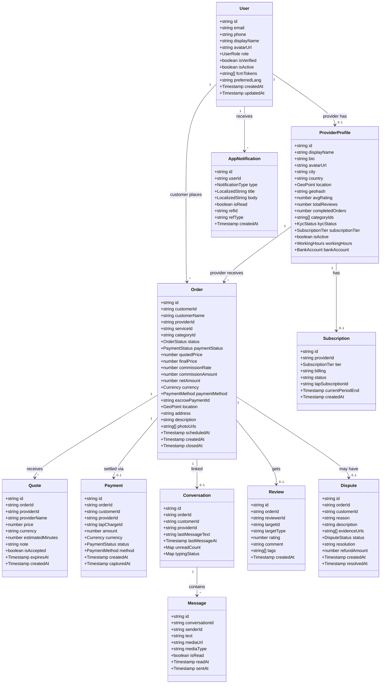
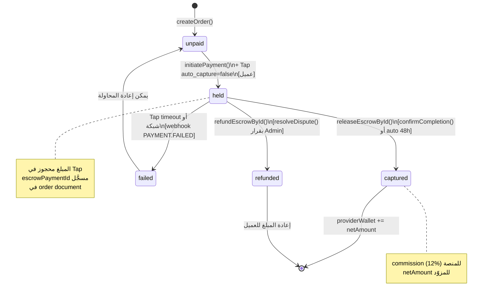
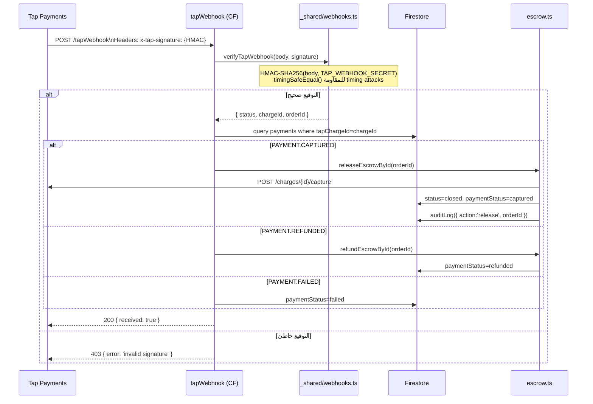
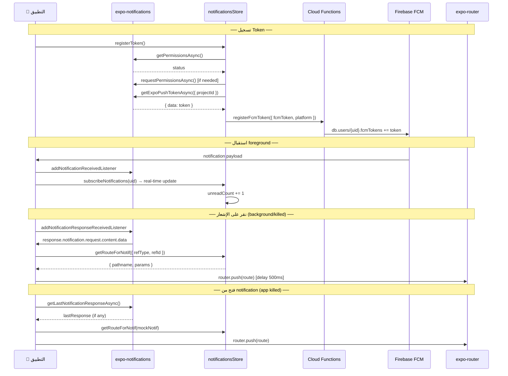

# WorkFix — وثيقة المشروع الشاملة
## Part 2/3 — الأقسام (6) إلى (11)

---

## (6) قاعدة البيانات — Database & Security

### 6.1 ERD — classDiagram



### 6.2 جدول المجموعات — Collections

| المجموعة / Subcollection | المفاتيح الرئيسية | الفهارس المركبة | ملاحظات |
|---|---|---|---|
| `users/{uid}` | id, email, phone, displayName, role, fcmTokens | — | كل مستخدم |
| `users/{uid}/notifications/{nid}` | userId, type, refId, refType, isRead | `createdAt DESC` (limit 50) | real-time subscription |
| `providerProfiles/{uid}` | id, geohash, categoryIds, isActive, kycStatus | `isActive+geohash`, `isActive+categoryIds+geohash` | البحث الجغرافي |
| `orders/{id}` | customerId, providerId, status, paymentStatus | `customerId+createdAt`, `providerId+status+createdAt`, `status+scheduledAt` | دورة الحياة |
| `orders/{id}/quotes/{id}` | providerId, price, isAccepted, expiresAt | `createdAt DESC` | عروض الأسعار |
| `conversations/{id}` | orderId, customerId, providerId, lastMessageAt | — | يُنشأ بواسطة getOrCreateConversation |
| `conversations/{id}/messages/{id}` | conversationId, senderId, sentAt | `conversationId+sentAt ASC` (limit 30) | real-time |
| `payments/{id}` | orderId, tapChargeId, status | `providerId+status` | سجل المدفوعات |
| `reviews/{id}` | targetId, rating, createdAt | `targetId+createdAt` | تقييمات المزوّدين |
| `disputes/{id}` | orderId, status | `orderId+status` | نزاعات الطلبات |
| `subscriptions/{id}` | providerId, tier, status | `providerId+status` | اشتراكات المزوّدين |
| `services/{id}` | providerId, categoryId, isActive | — | خدمات المزوّدين |
| `categories/{id}` | isActive, sortOrder | — | يُقرأ مرة واحدة ويُحفظ في store |
| `payouts/{id}` | providerId, status, amount | — | طلبات السحب |
| `_rateLimits/{key}` | hits[], blocked? | `lastHit ASC` | داخلي — لا يُقرأ من العميل |
| `_taskQueue/{id}` | type, status, runAfter, payload | `status+runAfter ASC` | queue: release_escrow... |
| `_auditLogs/{id}` | action, uid, data | — | سجل أمني |
| `fraudAlerts/{id}` | uid, signals | `uid+createdAt` | نظام كشف الاحتيال |

**مثال مستند Order مختصر:**

```json
{
  "id": "ord_abc123",
  "customerId": "usr_xyz",
  "customerName": "Ahmed Ali",
  "providerId": "usr_pqr",
  "serviceId": "svc_001",
  "categoryId": "cat_plumbing",
  "status": "confirmed",
  "paymentStatus": "held",
  "quotedPrice": 250,
  "commissionRate": 0.12,
  "netAmount": 220,
  "currency": "SAR",
  "paymentMethod": "card",
  "escrowPaymentId": "chg_tap_abc",
  "location": { "latitude": 24.713, "longitude": 46.675 },
  "address": "حي النزهة، الرياض",
  "description": "تسريب في الحمام",
  "photoUrls": ["https://storage.../photo1.jpg"],
  "createdAt": "2024-03-15T10:00:00Z"
}
```

### 6.3 ملخص Security Rules (منطق الأدوار)

| المجموعة | قراءة | كتابة | منطق خاص |
|---|---|---|---|
| `users/{uid}` | المالك أو Admin | المالك (لا يُعدّل role/isVerified) أو Admin | حقل role محمي من التعديل |
| `users/{uid}/notifications` | المالك | Admin أو Functions فقط | العميل يقرأ ويُعدّل isRead فقط |
| `providerProfiles/{uid}` | أي مستخدم مصادق | المالك (لا يُعدّل kycStatus/avgRating) أو Admin | kycStatus يُعدَّل بـ Admin/Functions فقط |
| `orders/{id}` | طرفا الطلب أو Admin | إنشاء: customer فقط، تحديث: كل طرف حسب دوره | status transitions محكومة |
| `orders/{id}/quotes` | طرفا الطلب أو Admin | كتابة: provider المالك، تحديث: customer | لا حذف |
| `conversations/{id}` | طرفا المحادثة أو Admin | Functions فقط (getOrCreateConversation) | — |
| `conversations/{id}/messages` | طرفا المحادثة | كتابة: Functions/markRead فقط | — |
| `payments/{id}` | طرفا الطلب أو Admin | Functions فقط | لا كتابة مباشرة من العميل |
| `reviews/{id}` | عام (قراءة) | Functions فقط | لا كتابة مباشرة |
| `disputes/{id}` | طرفا الطلب أو Admin | إنشاء: Functions، تحديث: Admin | — |
| `_rateLimits`, `_taskQueue` | ممنوع من العميل | Functions فقط | internal collections |

---

## (7) المدفوعات والـ Escrow

### 7.1 State Machine — حالات الدفع



### 7.2 جدول Hold → Capture → Refund

| الحدث | المصدر | الصلاحية | الإجراء | الحالة قبل | الحالة بعد |
|---|---|---|---|---|---|
| `initiatePayment()` | عميل (UI) | customer | Tap POST /charges (auto_capture=false) | unpaid | held |
| `tapWebhook PAYMENT.HELD` | Tap HTTP | webhook + HMAC | تحديث order.paymentStatus | unpaid | held |
| `confirmCompletion()` | عميل (UI) | customer | `releaseEscrowById()` | held | captured |
| Auto-release (48h) | Queue task | Functions فقط | `releaseEscrowById()` | held | captured |
| `resolveDispute()` | Admin panel | superadmin | `refundEscrowById()` | held | refunded |
| `tapWebhook PAYMENT.FAILED` | Tap HTTP | webhook + HMAC | تحديث status | held | failed |

### 7.3 Sequence Diagram — Webhook والتحقق بالتوقيع



---

## (8) i18n و RTL/LTR

### 8.1 جدول Namespaces والشاشات

| Namespace | الشاشات المستخدِمة | أمثلة مفاتيح |
|---|---|---|
| `common` | جميع الشاشات | `loading, error, retry, cancel, confirm, save, back, done, yes, no` |
| `auth` | Login/Register/OTP/ForgotPassword/ProviderType | `welcome, loginTitle, email, password, phone, otp, forgotPassword, orContinueWith` |
| `home` | HomeScreen, SearchScreen | `greeting, searchPlaceholder, categories, nearbyProviders, noProvidersNearby` |
| `orders` | MyOrders/OrderDetail/CreateOrder | `title, newOrder, descriptionLabel, status, quoteReceived, acceptQuote, confirmDone` |
| `payment` | PaymentScreen/WalletScreen | `title, total, method, card, applePay, stcPay, escrowNote, payNow, success` |
| `chat` | ChatScreen/ConversationsScreen | `placeholder, send, typing, today, yesterday` |
| `provider` | ProviderProfile/Dashboard/Wallet | `rating, reviews, wallet, balance, sendQuote, quotePrice, requestPayout` |
| `profile` | ProfileScreen + sub-screens | `editProfile, changePassword, myServices, statistics, bankAccount` |
| `disputes` | DisputeScreen | `title, reason, submitted, submitFailed, evidenceHint` |
| `reviews` | ReviewScreen | `rating1..5, addComment, submit, ratingRequired, skipForNow` |
| `subscriptions` | SubscriptionsScreen | `free, pro, business, month, save30, cancelAnytime` |
| `notifications` | NotificationsScreen | `title, noNotifications, markAllRead` |
| `errors` | جميع النماذج | `nameTooShort, invalidEmail, passwordTooShort, invalidPhone` |
| `tabs` | (tabs)/_layout | `home, orders, messages, profile` |
| `onboarding` | OnboardingScreen | `slide1Title, slide2Title, getStarted` |
| `search` | SearchScreen | `filterBy, sortBy, radius, noResults, tryExpandingRadius` |

### 8.2 سياسة RTL/LTR — الكود التفصيلي

```ts
// ── عند تحميل i18n.ts (module load) ────────────────────────────────────────
const savedLang = (storage.getString('lang') ?? 'ar') as SupportedLocale

// allowRTL(true) مرة واحدة — يُعلم RN أن RTL مدعوم
I18nManager.allowRTL(true)
// لا نستدعي forceRTL هنا — نتركها لـ changeLanguage فقط

// ── عند تغيير اللغة ──────────────────────────────────────────────────────────
export async function changeLanguage(lang: SupportedLocale): Promise<void> {
  const goingRTL = isRtlLocale(lang)     // ar === RTL
  const nowRTL   = I18nManager.isRTL     // حالة الجهاز الفعلية

  // حفظ اللغة أولاً (يبقى بعد الـ reload)
  storage.set('lang', lang)

  if (goingRTL !== nowRTL) {
    // تغيير الاتجاه يتطلب reload كامل
    I18nManager.allowRTL(true)
    I18nManager.forceRTL(goingRTL)
    await Updates.reloadAsync()   // لا يرجع — التطبيق يُعيد التشغيل
  } else {
    // EN ↔ NO ↔ SV — نفس الاتجاه، تبديل فوري بدون reload
    await i18n.changeLanguage(lang)
  }
}
```

**متى تُستدعى كل دالة:**

| الدالة | متى | ملاحظة |
|---|---|---|
| `I18nManager.allowRTL(true)` | مرة واحدة عند تحميل i18n.ts | يُعلم النظام أن RTL مدعوم |
| `I18nManager.forceRTL(true)` | عند تبديل إلى AR | يُطبّق فعلياً |
| `I18nManager.forceRTL(false)` | عند التبديل من AR إلى EN/NO/SV | يُلغي الـ RTL |
| `Updates.reloadAsync()` | عند تغيير الاتجاه فقط | reload ضروري لـ layout engine |
| `i18n.changeLanguage(lang)` | EN ↔ NO ↔ SV | فوري بدون reload |

### 8.3 المفاتيح المفقودة

بعد مراجعة الكود: **لا توجد مفاتيح مفقودة فعلية** — 288 مفتاح معرَّف تغطي 271 مفتاح مستخدم. EXTRA_AR/EN/NO/SV تُكمّل الترجمات عبر `deepMerge()`.

---

## (9) Offline والاسترداد

### 9.1 جدول ما يعمل Offline

| العملية | Offline | آلية التخزين | ملاحظة |
|---|---|---|---|
| قراءة الطلبات المحملة | ✅ نعم | Firestore `persistentLocalCache` | تلقائي — يُعيد البيانات من الذاكرة |
| قراءة المحادثات/الرسائل | ✅ نعم | Firestore persistence | |
| قراءة الفئات | ✅ نعم | marketplaceStore memory | لا تنتهي حتى reload |
| قراءة الملف الشخصي | ✅ نعم | Firestore persistence | |
| **إنشاء طلب جديد** | ❌ لا | — | محجوب بـ `useIsOnline()` guard |
| **الدفع** | ❌ لا | — | محجوب بـ `useIsOnline()` guard |
| **إرسال رسالة** | ❌ لا | — | يفشل بـ sendError |
| **قبول عرض** | ❌ لا | — | يفشل بـ actionError |
| تسجيل الدخول | ❌ لا | — | يحتاج Firebase Auth |
| الاشتراك | ❌ لا | — | يحتاج Tap redirect |

### 9.2 الطابور المحلي — _taskQueue

| الجانب | التفاصيل |
|---|---|
| **التخزين** | Firestore collection: `_taskQueue/{taskId}` |
| **الحقول** | `type` (e.g. `release_escrow`), `payload`, `status` (pending/processing/done/failed), `runAfter`, `attempts`, `maxAttempts:3` |
| **المعالج** | `processTaskQueue` — Cloud Scheduler كل دقيقة |
| **Retry** | exponential backoff، max 3 محاولات |
| **الاستخدام الرئيسي** | إفراج تلقائي عن الضمان بعد 48h |

### 9.3 نقاط الفشل ورسائل واجهة المستخدم

| نقطة الفشل | رسالة المستخدم | المصدر |
|---|---|---|
| لا اتصال + محاولة دفع | `'لا يوجد اتصال بالإنترنت'` (Alert) | `useIsOnline()` في PaymentScreen |
| لا اتصال + إنشاء طلب | `'لا يوجد اتصال بالإنترنت'` (Alert) | `useIsOnline()` في CreateOrderScreen |
| انقطاع الشبكة عام | `OfflineBanner` يظهر في الأعلى | `_layout.tsx` دائم |
| خطأ Cloud Function | رسالة عربية من `getErrorMessage(err.code)` | كل الـ stores |
| Rate limit تجاوز | `'محاولات كثيرة. يرجى الانتظار.'` | auth error mapping |
| خطأ تحميل الطلب | `'فشل تحميل الطلب'` + `actionError` | ordersStore |
| فشل إرسال رسالة | `'فشل إرسال الرسالة'` + `sendError` | messagingStore |
| فشل Tap redirect | Alert في PaymentScreen | paymentsStore.initiatePayment |
| انتهاء مهلة escrow | قائمة انتظار تُعالجها في الخلفية تلقائياً | processTaskQueue |
| خطأ OTA | `fallbackToCacheTimeout:3000` → يعمل بالـ bundle القديم | app.json |

---

## (10) الإشعارات و Deep Links

### 10.1 Sequence — FCM من التسجيل إلى فتح الشاشة



### 10.2 جدول Deep Links

| Scheme/Path | الشاشة | Params | مثال |
|---|---|---|---|
| `workfix://orders/{id}` | `OrderDetailScreen` | `id: orderId` | `workfix://orders/ord_abc123` |
| `workfix://chat/{id}` | `ChatScreen` | `id: convId` | `workfix://chat/conv_xyz` |
| `workfix://provider/{id}` | `ProviderProfileScreen` | `id: providerId` | `workfix://provider/usr_pqr` |
| `workfix://notifications` | `NotificationsScreen` | — | `workfix://notifications` |
| `workfix://wallet` | `WalletScreen` | — | `workfix://wallet` |
| `workfix://subscriptions` | `SubscriptionsScreen` | — | `workfix://subscriptions` |
| `https://workfix.app/...` | iOS Universal Links | — | إعادة توجيه للـ scheme |

### 10.3 جدول NotificationType → Route

| `NotificationType` | `refType` | الوجهة | params |
|---|---|---|---|
| `order_placed` | `order` | `/orders/[id]` | `{ id: refId }` |
| `quote_received` | `order` | `/orders/[id]` | `{ id: refId }` |
| `quote_accepted` | `order` | `/orders/[id]` | `{ id: refId }` |
| `payment_confirmed` | `order` | `/orders/[id]` | `{ id: refId }` |
| `order_in_progress` | `order` | `/orders/[id]` | `{ id: refId }` |
| `order_completed` | `order` | `/orders/[id]` | `{ id: refId }` |
| `order_closed` | `order` | `/orders/[id]` | `{ id: refId }` |
| `order_cancelled` | `order` | `/orders/[id]` | `{ id: refId }` |
| `new_message` | `message` | `/chat/[id]` | `{ id: refId }` |
| `dispute_opened` | `dispute` | `/orders/[id]` | `{ id: refId }` |
| `dispute_resolved` | `dispute` | `/orders/[id]` | `{ id: refId }` |
| `kyc_approved` | — | `/(tabs)/provider` | — |
| `kyc_rejected` | — | `/(tabs)/profile` | — |
| `payout_processed` | `payment` | `/wallet` | — |

---

## (11) الأداء والحجم

### 11.1 جدول إعدادات الأداء

| الإعداد | القيمة | الموقع | الأثر |
|---|---|---|---|
| **Hermes iOS** | `"jsEngine": "hermes"` | `app.json > ios` | تقليل وقت البدء ~30% + ذاكرة أقل |
| **Hermes Android** | `"jsEngine": "hermes"` | `app.json > android` | نفسه |
| **Reanimated plugin** | آخر plugin في babel | `babel.config.js` | ضروري لتجنب أخطاء worklets |
| **NativeWind v4** | `withNativeWind` في metro | `metro.config.js` | CSS → StyleSheet عند البناء (no runtime overhead) |
| **Expo Router Lazy** | تلقائي لكل route file | — | كل شاشة تُحمَّل عند الطلب فقط |
| **FlatList** | `initialNumToRender=10`, `maxToRenderPerBatch=10`, `windowSize=5` | جميع شاشات القوائم | تقليل الـ render الأولي |
| **React.memo** | `OrderCard` في MyOrdersScreen | `MyOrdersScreen.tsx` | تجنب re-render بطاقة الطلب |
| **AbortController** | `searchProviders()` | `marketplaceStore.ts` | إلغاء طلبات البحث القديمة |
| **Firestore Cache** | `CACHE_SIZE_UNLIMITED` + `persistentLocalCache` | `firebase.ts` | offline reading + faster re-reads |
| **assetBundlePatterns** | `["**/*"]` | `app.json` | يجمع كل الأصول في الـ bundle |
| **EAS OTA** | `checkAutomatically: "ON_LOAD"` + `fallbackToCacheTimeout: 3000` | `app.json` | تحديثات فورية مع fallback آمن |
| **Search AbortController** | `_searchAbort` في marketplaceStore | `marketplaceStore.ts` | منع race conditions في البحث |

### 11.2 تقدير الأداء (مبني على الإعدادات)

| المقياس | التقدير | الأساس |
|---|---|---|
| وقت بدء cold start | ~2-3 ثانية | Hermes + Expo Router lazy loading |
| حجم JS bundle | ~4-6 MB | 35 dep، لا imports ثقيلة غير ضرورية |
| First render | < 100ms | Hermes JIT + persistentLocalCache |
| FlatList (100 item) | smooth 60fps | initialNumToRender=10 + windowSize=5 |
| Real-time latency | < 500ms | Firestore onSnapshot (WebSocket) |
| OTA update size | ~500KB-2MB | JS only (لا native changes) |

