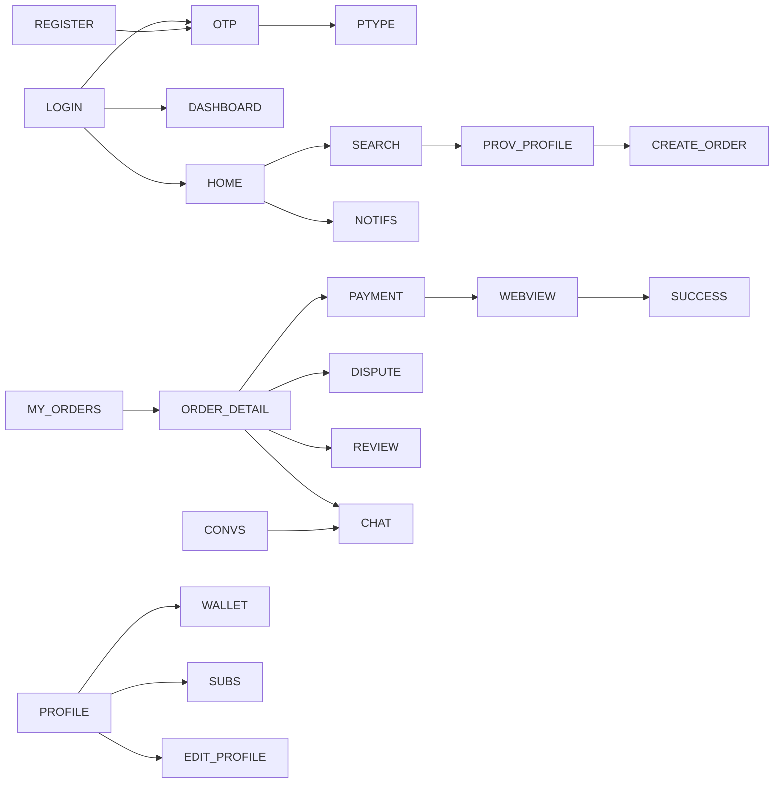
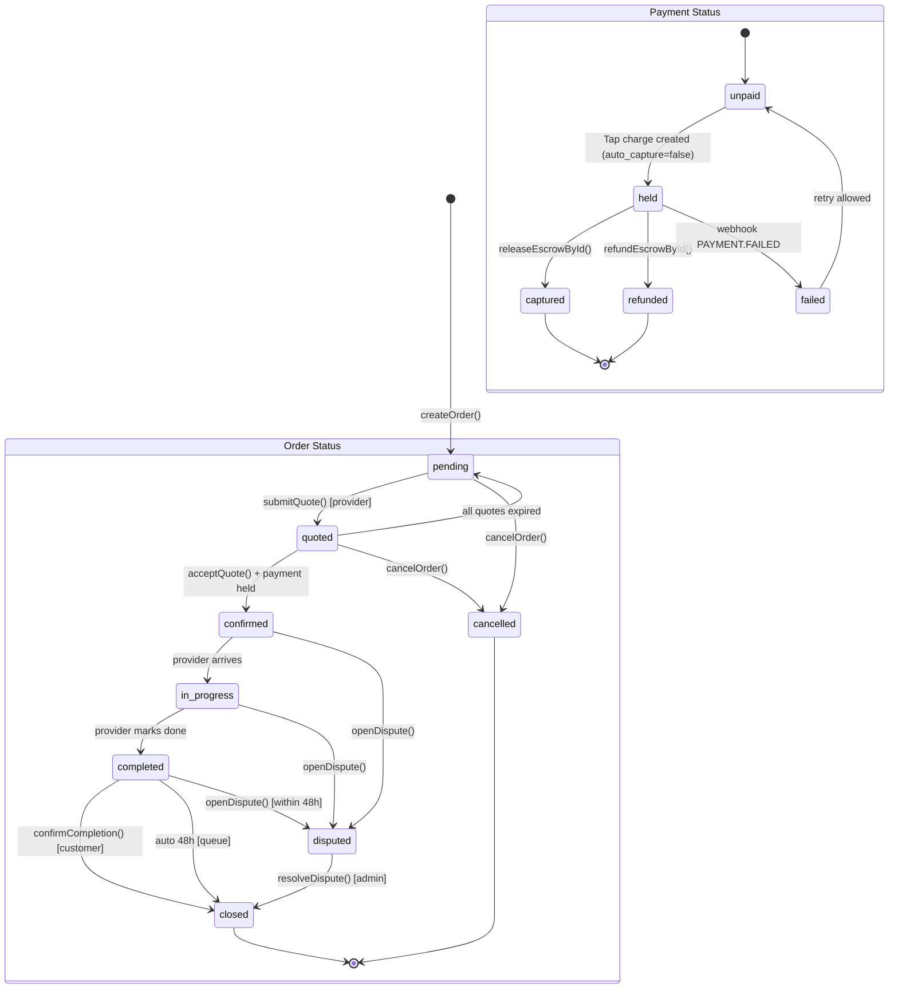
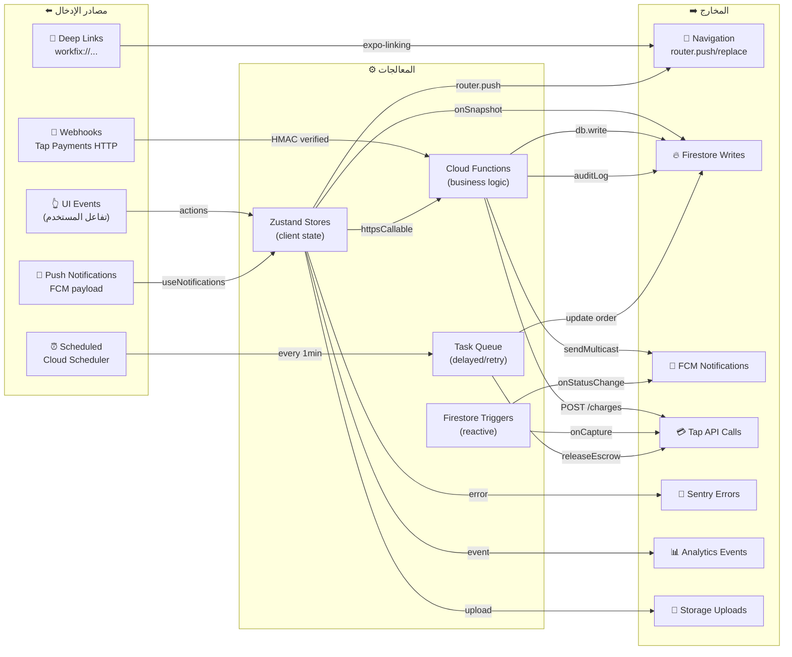

# WorkFix — وثيقة المشروع الشاملة
## Part 3/3 — الأقسام (12) إلى (16)

---

## (12) الوصول (Accessibility)

### 12.1 قائمة العناصر التفاعلية التي تحتاج تحسيناً

| الشاشة | العنصر | المشكلة | الأولوية |
|---|---|---|---|
| كل الشاشات | `Button` (ui/index.tsx) | ✅ مُصلَح: accessibilityRole + accessibilityLabel + accessibilityState | — |
| كل الشاشات | `ScreenHeader` back button | ✅ مُصلَح: accessibilityRole="button" + label="رجوع" | — |
| كل الشاشات | `OfflineBanner` | ✅ مُصلَح: accessibilityRole="alert" + liveRegion="polite" | — |
| LoginScreen | زر "تسجيل الدخول" | ✅ accessibilityLabel من t() | — |
| PaymentScreen | بطاقات طريقة الدفع | كل `TouchableOpacity` بدون accessibilityLabel | عالي |
| SearchScreen | بطاقات المزوّدين | `ProviderCard` بدون role="button" | متوسط |
| OrderDetailScreen | أزرار "قبول عرض" | accessibilityHint لشرح ما سيحدث | متوسط |
| ChatScreen | `FlatList` items | رسائل بدون accessibilityLabel | منخفض |
| ProfileScreen | عناصر القائمة | كل `TouchableOpacity` بحاجة label | متوسط |
| CategoriesScreen | بطاقات الفئات | accessibilityLabel بالاسم العربي | متوسط |
| HomeScreen | شريط البحث | accessibilityHint="ابحث عن مزوّدي خدمات" | منخفض |
| ProviderProfileScreen | صورة المزوّد | Image بدون accessibilityLabel | منخفض |

### 12.2 أمثلة إصلاح عملية

```tsx
// ── 1. PaymentScreen — بطاقة طريقة الدفع ──────────────────────────────────
// قبل
<TouchableOpacity onPress={() => setSelectedMethod(method.key)}>
  <Text>{method.emoji} {method.label}</Text>
</TouchableOpacity>

// بعد
<TouchableOpacity
  onPress={() => setSelectedMethod(method.key)}
  accessibilityRole="radio"
  accessibilityLabel={method.label}
  accessibilityState={{ selected: selectedMethod === method.key }}
  accessibilityHint={method.hint ?? `ادفع بـ ${method.label}`}
>
  <Text>{method.emoji} {method.label}</Text>
</TouchableOpacity>
```

```tsx
// ── 2. OrderDetailScreen — زر قبول العرض ──────────────────────────────────
// قبل
<Button label={t('orders.acceptQuote')} onPress={() => handleAcceptQuote(q.id)} />

// بعد
<Button
  label={t('orders.acceptQuote')}
  onPress={() => handleAcceptQuote(q.id)}
  accessibilityLabel={`${t('orders.acceptQuote')} - ${formatPrice(q.price, q.currency)}`}
  accessibilityHint={t('orders.acceptQuoteHint')}  // "سيتم الانتقال لصفحة الدفع"
/>
```

```tsx
// ── 3. ProfileScreen — قائمة الخيارات ────────────────────────────────────
// قبل
<TouchableOpacity onPress={() => router.push('/profile/edit')}>
  <Text>✏️ تعديل الملف الشخصي</Text>
  <Text>›</Text>
</TouchableOpacity>

// بعد
<TouchableOpacity
  onPress={() => router.push('/profile/edit')}
  accessibilityRole="button"
  accessibilityLabel="تعديل الملف الشخصي"
  accessibilityHint="ينقلك لشاشة تعديل الاسم والصورة"
>
  <Text>✏️ تعديل الملف الشخصي</Text>
  <Text aria-hidden>›</Text>
</TouchableOpacity>
```

```tsx
// ── 4. ProviderCard — بطاقة المزوّد ──────────────────────────────────────
// قبل
<TouchableOpacity onPress={onPress}>
  <Image source={{ uri: provider.avatarUrl }} />
  <Text>{provider.displayName}</Text>
  <Text>⭐ {provider.avgRating}</Text>
</TouchableOpacity>

// بعد
<TouchableOpacity
  onPress={onPress}
  accessibilityRole="button"
  accessibilityLabel={`${provider.displayName}، تقييم ${provider.avgRating} من 5`}
  accessibilityHint="اضغط لعرض الملف الشخصي"
>
  <Image
    source={{ uri: provider.avatarUrl }}
    accessibilityLabel={`صورة ${provider.displayName}`}
  />
  <Text>{provider.displayName}</Text>
  <Text aria-hidden>⭐ {provider.avgRating}</Text>
</TouchableOpacity>
```

---

## (13) الرسوم الإلزامية (Mermaid)

### 13.1 Navigation Graph

*(مُضمَّن في القسم 2.1 بالتفصيل الكامل)*



### 13.2 Component/Module Diagram

```mermaid
graph TD
    subgraph UI_LAYER["طبقة UI"]
        SCREENS["31 Screen Component"]
        COMP_UI["ui/index.tsx\nButton/Input/Card/Screen"]
        COMP_MKT["marketplace.tsx\nProviderCard/EmptyState"]
        COMP_ORD["orders.tsx\nStatusBadge/QuoteCard"]
        COMP_SHARED["ScreenHeader\nErrorBoundary\nOfflineBanner"]
    end

    subgraph STATE_LAYER["طبقة الحالة (Zustand)"]
        AUTH_S["authStore"]
        ORDERS_S["ordersStore"]
        PAY_S["paymentsStore"]
        MSG_S["messagingStore"]
        MKT_S["marketplaceStore"]
        NOTIF_S["notificationsStore"]
    end

    subgraph HOOKS["Custom Hooks"]
        USE_AUTH["useAuth"]
        USE_LOC["useLocation"]
        USE_IMG["useImageUpload"]
        USE_NET["useNetworkState"]
        USE_NOTIF["useNotifications"]
    end

    subgraph LIB_LAYER["طبقة Lib"]
        FIREBASE_L["firebase.ts\nSingletons"]
        I18N_L["i18n.ts\nAR/EN/NO/SV"]
        ANALYTICS_L["analytics.ts\n25 events"]
        MONITORING_L["monitoring.ts\nSentry+Crashlytics"]
        FLAGS_L["featureFlags.ts\nRemote Config"]
        THEME["theme.ts\nColors/Spacing"]
    end

    subgraph CF_LAYER["Cloud Functions (32)"]
        AUTH_CF["auth/*\n3 callables"]
        ORDERS_CF["orders/*\n5 callables"]
        PAY_CF["payments/*\n4 + webhook"]
        MSG_CF["messaging/*\n3 callables"]
        MKT_CF["marketplace/*\n3 callables"]
        NOTIF_CF["notifications/*\n2 callables"]
        ADMIN_CF["admin/*\n4 callables"]
        SUBS_CF["subscriptions/*\n1 callable + webhook"]
        REV_CF["reviews/*\n2 callables"]
        TRIGGERS["triggers/*\n4 Firestore triggers"]
        QUEUE["queue\n2 scheduled"]
    end

    subgraph EXTERNAL["خدمات خارجية"]
        FS["Firestore"]
        FA["Firebase Auth"]
        FST["Firebase Storage"]
        FRCM["FCM"]
        FRC["Remote Config"]
        TAP["Tap Payments"]
        SENTRY["Sentry"]
    end

    SCREENS --> COMP_UI & COMP_MKT & COMP_ORD & COMP_SHARED
    SCREENS --> STATE_LAYER
    SCREENS --> HOOKS
    SCREENS --> LIB_LAYER

    AUTH_S --> FIREBASE_L --> FA
    ORDERS_S --> ORDERS_CF --> FS
    PAY_S --> PAY_CF --> TAP
    MSG_S --> MSG_CF --> FS
    MKT_S --> MKT_CF --> FS
    NOTIF_S --> NOTIF_CF --> FRCM

    MONITORING_L --> SENTRY
    ANALYTICS_L --> FRCM
    FLAGS_L --> FRC
    USE_IMG --> FST
    TRIGGERS --> FRCM & FS & TAP
    QUEUE --> TAP & FS
```



### 13.3 Full Sequence Diagram

*(مُضمَّن كاملاً في القسم 5.3 — دورة حياة الطلب من الإنشاء إلى الإفراج)*

### 13.4 ERD classDiagram

*(مُضمَّن كاملاً في القسم 6.1)*

### 13.5 State Machine — Orders + Payments



### 13.6 Ports & Adapters Diagram



---

## (14) مصفوفات إضافية

### 14.1 Navigation Adjacency Matrix

| من \ إلى | Home | MyOrders | Convs | Profile | Dashboard | OrderDetail | Payment | Chat | ProvProfile | Search |
|:---|:---:|:---:|:---:|:---:|:---:|:---:|:---:|:---:|:---:|:---:|
| **Onboarding** | — | — | — | — | — | — | — | — | — | — |
| **Login** | ✓ | — | — | — | ✓ | — | — | — | — | — |
| **Register** | — | — | — | — | — | — | — | — | — | — |
| **OTP** | ✓ | — | — | — | ✓ | — | — | — | — | — |
| **ProviderType** | — | — | — | — | ✓ | — | — | — | — | — |
| **Home** | — | — | — | — | — | — | — | — | ✓ | ✓ |
| **MyOrders** | — | — | — | — | — | ✓ | — | — | — | — |
| **Conversations** | — | — | — | — | — | — | — | ✓ | — | — |
| **Profile** | — | — | — | — | — | — | — | — | — | — |
| **Dashboard** | — | — | — | — | — | ✓ | — | — | — | — |
| **OrderDetail** | — | ✓ | — | — | — | — | ✓ | ✓ | ✓ | — |
| **Payment** | — | — | — | — | — | — | — | — | — | — |
| **PayWebView** | — | — | — | — | — | — | — | — | — | — |
| **PaySuccess** | — | — | — | — | — | ✓ | — | — | — | — |
| **Search** | — | — | — | — | — | — | — | — | ✓ | — |
| **ProvProfile** | — | — | — | — | — | — | — | ✓ | — | — |
| **Notifications** | — | — | — | — | — | ✓ | — | ✓ | — | — |

### 14.2 Traceability Matrix — Use-case إلى ملفات

| Use-case | الشاشات | الستورات | Cloud Functions | Collections | Rules |
|---|---|---|---|---|---|
| تسجيل مستخدم جديد | Login, Register, OTP, ProviderType | authStore | completeProfile, setProviderType | users, providerProfiles | users.create |
| البحث عن مزوّد | Home, Search, Categories | marketplaceStore | searchProviders, getProviderProfile | providerProfiles, categories | providerProfiles.read |
| إنشاء طلب | ProviderProfile, CreateOrder | ordersStore | createOrder | orders, services | orders.create |
| تقديم عرض سعر | ProviderDashboard, OrderDetail | ordersStore | submitQuote | orders/quotes | quotes.create |
| قبول عرض + دفع | OrderDetail, Payment, WebView, Success | ordersStore, paymentsStore | acceptQuote, initiatePayment | orders, payments | payments.write=Functions |
| تنفيذ + تأكيد | OrderDetail | ordersStore | confirmCompletion | orders | orders.update |
| إفراج الضمان | — (تلقائي) | — | escrow.releaseEscrowById | payments, orders | payments=Functions |
| محادثة | Conversations, Chat | messagingStore | getOrCreateConversation, sendMessage | conversations, messages | messages.write=Functions |
| إشعارات push | NotificationsScreen, useNotifications | notificationsStore | registerFcmToken, triggers | users/notifications | notifications.read=owner |
| اشتراك المزوّد | Subscriptions | paymentsStore | createSubscription | subscriptions | subscriptions.read=owner |
| نزاع | Dispute | ordersStore | openDispute, resolveDispute | disputes | disputes.create=Function |
| تقييم | Review | ordersStore | submitReview | reviews | reviews.write=Functions |
| KYC | ProviderType, (admin panel) | authStore | uploadKyc, approveKyc | providerProfiles | kycStatus=Admin |
| تغيير اللغة | ProfileScreen, i18n | — | — | MMKV (local) | — |
| Offline recovery | — | Firestore persistence | — | Firestore cache | — |

### 14.3 Identifiers Index

#### Route Paths

```
/
/auth/login
/auth/register
/auth/otp
/auth/provider-type
/auth/forgot-password
/(tabs)
/(tabs)/orders
/(tabs)/messages
/(tabs)/profile
/(tabs)/provider
/orders/[id]
/orders/create
/orders/payment
/orders/payment-webview
/orders/payment-success
/orders/dispute
/orders/review
/chat/[id]
/provider/[id]
/search
/categories
/notifications
/wallet
/subscriptions
/profile/edit
/profile/edit-photo
/profile/change-password
/profile/bank-account
/profile/services
/profile/stats
/support/faq
/support/contact
/support/terms
/support/privacy
/+not-found
```

#### Firestore Collection IDs

```
users
providerProfiles
orders
payments
conversations
messages
reviews
disputes
categories
services
subscriptions
payouts
adminTasks
scheduledReleases
_rateLimits
_taskQueue
_auditLogs
fraudAlerts
```

#### Feature Flag Keys (Remote Config)

```ts
const FEATURE_FLAGS = {
  SUBSCRIPTIONS_ENABLED:  'subscriptions_enabled',   // اشتراكات pro/business
  BOOST_ENABLED:          'boost_enabled',           // تعزيز ظهور المزوّد
  DISPUTES_ENABLED:       'disputes_enabled',        // رفع النزاعات
  CASH_PAYMENT_ENABLED:   'cash_payment_enabled',    // الدفع نقداً
  AGENCY_MODEL_ENABLED:   'agency_model_enabled',    // نموذج الوكالة
  NORWAY_MARKET_ENABLED:  'norway_market_enabled',   // السوق النرويجي
  SWEDEN_MARKET_ENABLED:  'sweden_market_enabled',   // السوق السويدي
}
// Additional runtime flags (set via Remote Config):
// commission_rate, min_order_amount_sar, max_quote_expiry_hours
// maintenance_mode, force_update_version, support_chat_url
```

#### Analytics Event Names

```
sign_up_start          ← Analytics.signUpStart(method)
sign_up                ← Analytics.signUpComplete(role)
login                  ← Analytics.login(method)
kyc_submitted          ← Analytics.kycSubmitted()
kyc_approved           ← Analytics.kycApproved()
provider_search        ← Analytics.providerSearch(query, catId?)
provider_profile_view  ← Analytics.providerProfileView(providerId, name)
category_selected      ← Analytics.categorySelected(catId, name)
order_started          ← Analytics.orderStarted(catId)
order_submitted        ← Analytics.orderSubmitted(orderId, catId)
quote_received         ← Analytics.quoteReceived(orderId, count)
quote_accepted         ← Analytics.quoteAccepted(orderId, amount, currency)
payment_started        ← Analytics.paymentStarted(orderId, method, amount)
purchase               ← Analytics.paymentComplete(orderId, amount, currency)
order_completed        ← Analytics.orderCompleted(orderId)
order_cancelled        ← Analytics.orderCancelled(orderId, reason)
chat_message_sent      ← Analytics.chatMessageSent(convId)
review_submitted       ← Analytics.reviewSubmitted(rating)
dispute_opened         ← Analytics.disputeOpened(reason)
subscription_started   ← Analytics.subscriptionStarted(tier, billing)
subscription_upgraded  ← Analytics.subscriptionUpgraded(from, to)
boost_purchased        ← Analytics.boostPurchased(duration)
notification_tapped    ← Analytics.notificationTapped(type)
```

#### Error Codes

```
AUTH_001: USER_NOT_FOUND
AUTH_002: ROLE_NOT_ALLOWED
AUTH_003: ACCOUNT_SUSPENDED
AUTH_004: KYC_NOT_APPROVED
AUTH_005: PROFILE_INCOMPLETE
ORD_001:  ORDER_NOT_FOUND
ORD_002:  INVALID_ORDER_TRANSITION
ORD_003:  PROVIDER_NOT_AVAILABLE
ORD_004:  QUOTE_EXPIRED
ORD_005:  ORDER_ALREADY_HAS_PROVIDER
PAY_001:  PAYMENT_FAILED
PAY_002:  ESCROW_HOLD_FAILED
PAY_003:  REFUND_NOT_ELIGIBLE
PAY_004:  INSUFFICIENT_BALANCE
PAY_005:  PAYOUT_FAILED
VAL_001:  INVALID_INPUT
VAL_002:  MISSING_REQUIRED_FIELD
VAL_003:  VALUE_OUT_OF_RANGE
GEN_001:  INTERNAL_SERVER_ERROR
GEN_002:  RATE_LIMIT_EXCEEDED
GEN_003:  FEATURE_DISABLED
GEN_004:  NOT_FOUND
```

---

## (15) الملخص التنفيذي

### أهم النتائج (Top Findings)

| # | النتيجة | التأثير | التوصية | الأولوية |
|---|---|---|---|---|
| 1 | 25 شاشة لا تزال بدون `accessibilityLabel` كافٍ على `TouchableOpacity` | VoiceOver/TalkBack لا يقرأ العناصر بشكل صحيح | إضافة تدريجية حسب الأولوية: PaymentScreen → ProfileScreen → SearchScreen | 🟡 سريع |
| 2 | `ProviderStatsScreen` و`MyServicesScreen` يقرآن Firestore مباشرة | تجاوز Rate Limiting + لا Zod validation | نقل القراءة إلى Cloud Functions (getProviderStats, getMyServices) | 🟡 سريع |
| 3 | `functions/.env.local` موجود لكن لا تعليمات setup | قد تفشل الـ functions محلياً بدون مفاتيح | إضافة قسم "Local Functions Setup" في README | 🟢 سريع |
| 4 | E2E tests (Detox) لا تُشغَّل في CI | Zero E2E coverage في pipeline | ربط Detox بـ EAS Build (dev profile) + إضافة job في ci.yml | 🟡 متوسط |
| 5 | `SupportScreen` يعتمد على WebView لـ workfix.app | إن لم يكن الموقع جاهزاً → شاشة فارغة | توفير HTML محلي كـ fallback (FAQ, Terms) | 🟡 متوسط |
| 6 | `subscriptions/tapSubscriptionWebhook` بدون retry logic | خسارة إيرادات عند فشل webhook مؤقت | إضافة idempotency key + exponential backoff | 🔴 متوسط |
| 7 | لا Detox test لـ ChatScreen / PaymentScreen | المسارات الأكثر حساسية غير مختبرة E2E | إضافة flow: payment + chat في e2e/critical-flows.test.ts | 🟡 متوسط |
| 8 | أصول التطبيق (icon/splash) هي placeholders | رفض محتمل من App Store / Google Play | تصميم أصول احترافية (1024×1024 icon) | 🔴 قبل الإطلاق |
| 9 | `YOUR_EAS_PROJECT_ID` في app.json | OTA لن تعمل | تنفيذ `eas init` وتحديث app.json | 🔴 قبل الإطلاق |
| 10 | المفاتيح الحقيقية في `.env` غير مُعبَّأة | Firebase/Tap لن تعمل | تعبئة .env من لوحات Firebase/Tap الفعلية | 🔴 قبل الإطلاق |

### تقييم جاهزية الإطلاق

| الجانب | الحالة | تفاصيل |
|---|---|---|
| Architecture & Code Quality | ✅ جاهز | TypeScript strict, patterns صحيحة, SOLID |
| Auth & Security Rules | ✅ جاهز | role-based, HMAC webhook, rate limiting |
| Payment Escrow Flow | ✅ جاهز | Hold/Capture/Release/Refund مكتمل |
| Real-time Features | ✅ جاهز | orders/chat/notifications كلها onSnapshot |
| i18n (AR/EN/NO/SV) | ✅ جاهز | RTL policy صحيح، 288 مفتاح |
| Offline Resilience | ✅ جاهز | Firestore persistence + OfflineBanner + guards |
| CI/CD Pipeline | ✅ جاهز | 7 jobs، deploy-prod عند tags |
| OTA Updates | ✅ جاهز | runtimeVersion + appVersion policy |
| Monitoring (Sentry/Analytics) | ✅ جاهز | 25 events، PII scrubbing |
| Error Handling | ✅ جاهز | try/finally في كل الـ stores |
| Accessibility | ⚠️ جزئي | Button/Header/Banner مُصلَح، 25 شاشة متبقية |
| E2E Tests (Detox in CI) | ⚠️ يحتاج ربط | الـ tests موجودة لكن لا تعمل في CI |
| Production Assets | ❌ ناقص | placeholders فقط |
| Environment Keys | ❌ ناقص | .env لم تُعبَّأ بعد |
| EAS projectId | ❌ ناقص | YOUR_EAS_PROJECT_ID placeholder |

**الخلاصة:** المشروع **يمكن إطلاقه** بعد: (1) تعبئة .env الحقيقي، (2) eas init + app.json update، (3) تصميم الأصول، (4) اختبار يدوي كامل للـ flows الحرجة.

---

## (16) الافتراضات والملفات الناقصة

### 16.1 Assumptions (الفرضيات)

| # | الافتراض | السبب |
|---|---|---|
| 1 | `workfix.app` مجال مُعدَّ ويخدم صفحات support (FAQ/Terms/Privacy) | SupportScreen يفتح WebView لهذا المجال |
| 2 | Tap Payments webhook URL هو `https://{region}-{project}.cloudfunctions.net/tapWebhook` | لم يُحدَّد في الكود |
| 3 | `EXPO_PUBLIC_PROJECT_ID` = EAS project ID لـ expo-notifications | مُستخدَم في `getExpoPushTokenAsync` |
| 4 | Firebase project له `me-central1` region مُفعَّلة (MENA) | `firebaseFunctions = getFunctions(app, 'me-central1')` |
| 5 | إطار `recaptchaVerifier` مُعدَّ في LoginScreen لـ phone auth | التعليق في الكود يشير لذلك |
| 6 | `providerWallet` collection تُدار كلياً من Cloud Functions | لا كتابة مباشرة من العميل |
| 7 | Unifonic أو خدمة SMS مُعدَّة للأرقام MENA (SA/AE/KW) | NO/SE يستخدمان Firebase Auth Phone مباشرة |
| 8 | `service-account.json` للـ Play Store Submit موجود محلياً ولا يُحفظ في git | مُشار إليه في eas.json |
| 9 | الـ admin panel سيُبنى على Retool (وثّق في RETOOL_SETUP.md) | لا كود admin UI في الـ repo |

### 16.2 Missing Files — القائمة الكاملة

```
# أصول مؤقتة (placeholders — تحتاج تصميم حقيقي)
apps/mobile/assets/icon.png                     ← 1024×1024 أيقونة احترافية
apps/mobile/assets/splash.png                   ← شاشة بداية ذات تصميم
apps/mobile/assets/adaptive-icon.png            ← Android adaptive icon
apps/mobile/assets/notification-icon.png        ← أيقونة إشعارات Android

# ملفات بيئة غير مُعبَّأة
.env                                             ← من .env.example (15 متغير)
functions/.env.local                             ← TAP_SECRET_KEY + TAP_WEBHOOK_SECRET

# Detox E2E config
e2e/jest.config.js                               ← مطلوب لتشغيل Detox في CI

# الـ admin panel
apps/admin/src/                                  ← لا يوجد — يحتاج Next.js أو Retool config

# ملفات Git اختيارية
.github/CODEOWNERS                               ← تحديد مراجعي الكود
.github/PULL_REQUEST_TEMPLATE.md                 ← قالب طلبات الدمج

# Native prebuild output (لا تُحفظ في git)
android/                                         ← يُولَّد بـ expo prebuild
ios/                                             ← يُولَّد بـ expo prebuild

# Play Store submit
apps/mobile/service-account.json                 ← محلي فقط — eas submit
```

